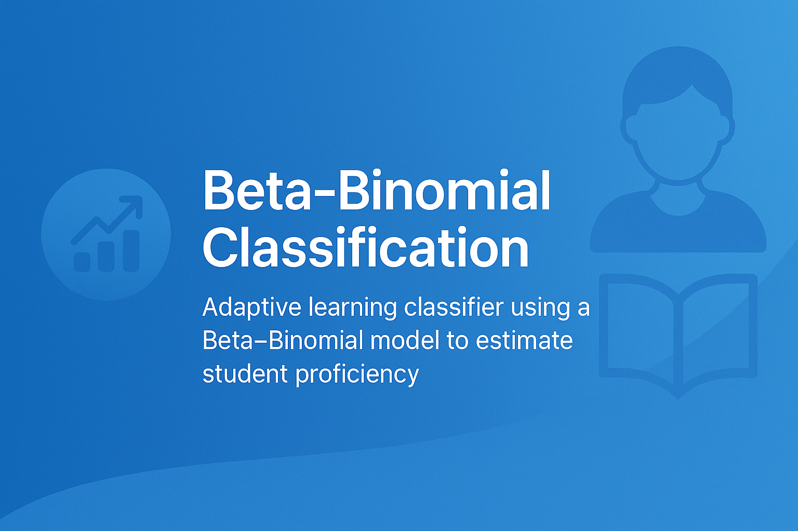

## 🧰 How to Use This Template

Click the green **"Use this template"** button at the top of the page, then choose **"Create a new repository"**.

This will create your own copy of this project, which you can modify freely — no need to fork!

---

<div align="center">
    
</div>

<h1 align="center">Beta–Binomial Classification</h1>

# 1. Quick Start

## 1.1 Prerequisites
- Docker and Docker Compose installed (Docker files remain unchanged)
- VS Code with Dev Containers extension (optional)

## 1.2 Setup and Run

```bash
# Make start.sh executable (if needed)
chmod +x start.sh

# Build and run the container
./start.sh
```

Alternatively:
```bash
docker-compose up --build -d
```

## 1.3 Verify
```bash
docker-compose ps
```
Confirm the container is up and port 8888 is mapped.

## 1.4 Run Python Scripts

In the VS Code terminal (inside the container), run:

```bash
python scripts/generate_beta_binomial_data.py
```

You should see the expected output (for example, confirmation message).

## 1.5 Work with Jupyter Notebooks in VS Code

- Open `notebooks/1_Intro_Beta_Binomial.ipynb` in VS Code.

- In VS Code, install the following extensions: Docker, Dev Containers, Python, Jupyter.

- VS Code will prompt you to select a kernel. Choose the Python kernel that is specified in the Dockerfile. The libraries that have been listed in the `requirements.txt` and installed in the docker will be run automatically.

- Now you can run and edit cells directly in VS Code.

## 1.6 Stop and Remove the Container

```bash
docker-compose down
```

# 2. Repository Structure

```
.
├── docs/                          # Educational docs
│   ├── Beta-Binomial-Classification.md
│   └── README.md
├── data/                          # Example and synthetic grouped counts
│   ├── beta_binomial_examples.csv
│   ├── beta_binomial_synthetic.csv
│   └── README.md
├── figures/                       # Generated visuals (mastery map)
│   └── README.md
├── notebooks/                     # Hands-on learning notebooks
│   ├── 1_Intro_Beta_Binomial.ipynb
│   ├── 2_Beta_Binomial_Classifier.ipynb
│   ├── 3_Visualization_Master_Map.ipynb
│   └── README.md
├── scripts/                       # Minimal, readable scripts
│   ├── generate_beta_binomial_data.py
│   ├── beta_binomial_classifier.py
│   ├── plot_mastery_map.py
│   └── README.md
├── requirements.txt
├── Dockerfile                     # untouched
├── docker-compose.yml             # untouched
└── start.sh                       # untouched
```

# 3. Learning Path

1. Read `docs/Beta-Binomial-Classification.md` for the concepts
2. Open `notebooks/1_Intro_Beta_Binomial.ipynb` to see posterior updates
3. Run `notebooks/2_Beta_Binomial_Classifier.ipynb` to classify data
4. Visualize mastery with `notebooks/3_Visualization_Master_Map.ipynb`

# 4. What You’ll Learn

- Posterior updates for Beta–Binomial (conjugacy)
- How to set priors and interpret uncertainty
- Mapping to mastery labels via credible bounds
- Visualizing attempts×successes mastery regions

# 5. Notes

- Media files in `docs/` are placeholders and will be replaced later
- Docker setup is preserved as in the template
